```mermaid
graph LR
    A[Ingestion: IMAP/API] --> B[1. Email Parser]
    B --> C[2. Auth & SPF/DKIM]
    C --> D[3. Global Reputation]
    D --> E[4. Behavioral Map]
    E --> F[5. URL Sandboxing]
    F --> G[6. Malware Scanner]
    G --> H[7. Heuristic Scoring]
    H --> I[8. AI Reasoning Agent]
    I --> J[9. Decision Matrix]
    J --> K[Final Verdict & DB]
```

# SecureMail-Backend 🛡️

## 🛡️ Deep Analysis: The Security Pipeline

SecureMail-Backend is the orchestration heart of the ecosystem. It implements a **10-Stage Security Pipeline** that processes every email from ingestion to a final human-readable report.

### ⚙️ Architecture Overview
The backend is a high-concurrency NestJS application that leverages **Prisma** for data persistence and **Bull (Redis)** for background orchestration.



### 🔍 Core Security Stages
1.  **Email Authentication**: Validates SPF, DKIM, and DMARC to prevent spoofing.
2.  **Intel Reputation**: Checks sender IP and Domain against multiple threat intelligence feeds (e.g., AbuseIPDB).
3.  **Behavioral Engine**: Tracks sender reputation and typical communication patterns for each mailbox.
4.  **Static Rule Engine**: Over 28 targeted rules ranging from "Homoglyph Attacks" to "Credit Card Data Theft".
5.  **Microservice Delegation**: Offloads Heavy Scanning (Go) and LLM Reasoning (Python) to specialized services via gRPC.

### 🛠️ Infrastructure
- **Database**: PostgreSQL (via Prisma ORM).
- **Caching/Queuing**: Redis (BullMQ) for asynchronous processing.
- **Microservices**: Orchestrates AI and Malware agents via gRPC.

---

## 🚀 Quick Start

Follow these steps to get the project running on your machine.

### 1. Clone the Repository
```bash
git clone <repository-url>
cd SecureMail-Backend
```

### 2. Configure Environment Variables
Copy the example environment file and adjust values as needed.
```bash
cp .env.example .env
# For Docker specifically
cp .env.example .env.docker
```

---

## 🐳 Option 1: Running with Docker (Recommended)
This method launches the entire stack (PostgreSQL, Redis, and Backend) in isolated containers.

**Prerequisites:** Docker & Docker Compose installed.

**Steps:**
1. Start the stack:
   ```bash
   docker compose up -d
   ```
2. Verify the application is running:
   ```bash
   docker compose logs backend -f
   ```
   *Expected Output: `[NestApplication] Nest application successfully started`*

---

## 🛠️ Option 2: Local Development
Use this for active coding and debugging.

**Prerequisites:** 
- Node.js v22+
- pnpm
- Running PostgreSQL & Redis instances

**Steps:**
1. Install dependencies:
   ```bash
   pnpm install
   ```
2. Generate Prisma Client (crucial for type safety):
   ```bash
   npx prisma generate
   ```
3. Run in development mode:
   ```bash
   pnpm run dev
   ```

---

## 🏗️ Technical Architecture

### Tech Stack
- **Framework**: [NestJS](https://nestjs.com/) (Node.js)
- **Database**: [PostgreSQL](https://www.postgresql.org/)
- **ORM**: [Prisma](https://www.prisma.io/)
- **Caching/Queuing**: [Redis](https://redis.io/)
- **Communication**: gRPC / REST
- **Security**: JWT, TOTP (2FA), Bcrypt

### Key Features
- **Prisma Integration**: Standardized `@prisma/client` implementation for robust database interactions.
- **Multistage Docker Build**: Hardened, production-ready images using Alpine Linux.
- **Security Pipeline**: Multi-layered threat simulation including malware scanning and AI-driven analysis.
- **Automated Deployments**: Integrated entrypoint scripts handling DB migrations automatically.

## 📁 Project Structure
- `src/`: Application source code.
- `prisma/`: Database schema and migrations.
- `contracts/`: gRPC proto definitions.
- `docker-compose.yml`: Infrastructure orchestration.

## ⚠️ Troubleshooting
- **Prisma Errors in Editor**: If you see red imports, run `npx prisma generate` locally.
- **Database Connection**: Ensure your `.env` values match your running database setup.
- **Proto Paths**: The application expects gRPC contracts at `/contracts` relative to the root.

---

Built with ❤️ by the SecureMail Team.
